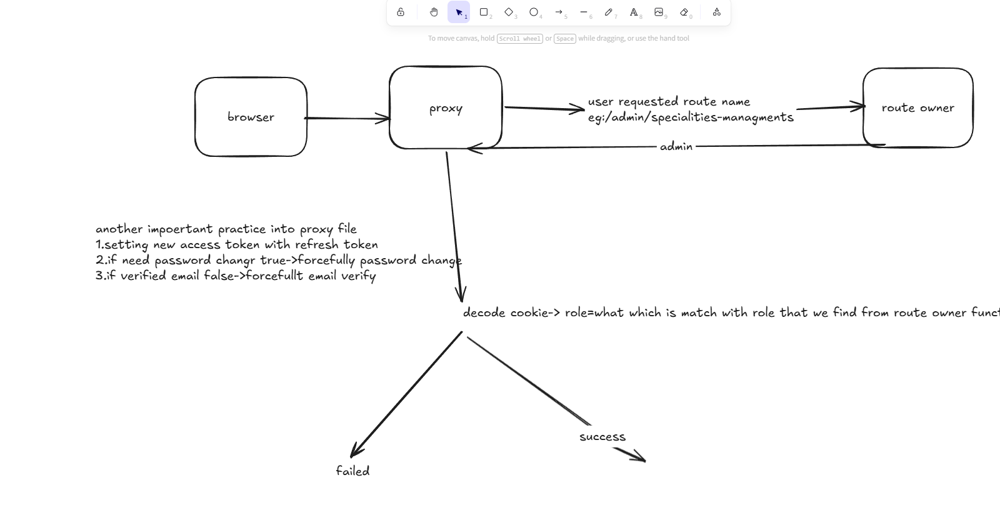

# PH Healthcare

**Where patients, doctors, and admins connect — appointments booked, prescriptions written, and health records managed in one place.**

[](https://nextjs.org)
[](https://react.dev)
[](https://www.typescriptlang.org)
[](https://tailwindcss.com)
[](https://tanstack.com)

---

## What is PH Healthcare?

PH Healthcare is a role-based healthcare management platform. Patients book appointments with doctors, doctors manage their schedules and write prescriptions, and admins oversee the entire system — users, specialties, payments, and reviews. The result is a structured multi-role workflow, not a generic CRUD app.

---

## The Appointment Journey

Every appointment on PH Healthcare follows this pipeline:

```
  PATIENT              PLATFORM              DOCTOR              ADMIN
  ───────              ────────              ──────              ─────

  Book slot      →   Appointment           Confirm /        Oversee all
  (pick doctor,       created               Manage           appointments
   date, time)        │                     │                payments
                      ├──────────────────→  Write Rx         reviews
                      │                     │
                      └── Payment ──────→   Health records updated
                          (if required)
```

Your dashboard shows exactly where each role sits in that workflow.

---

## Who Uses PH Healthcare?

| You are...      | What you can do                                                                 |
| --------------- | ------------------------------------------------------------------------------- |
| **A visitor**   | Browse doctors by specialty, view consultation info, read about services        |
| **A patient**   | Book appointments, view prescriptions, manage health records, track payments    |
| **A doctor**    | Manage schedules, handle appointments, write prescriptions, view patient reviews |
| **An admin**    | Manage all users, doctors, specialties, schedules, appointments, and payments   |

Role separation is enforced server-side — the frontend reads your JWT, the backend verifies it.

---

## What's Actually Happening Behind the UI

The browser never talks directly to the backend. Every request goes through a custom **Axios HTTP client** with automatic token refresh:

```
  Browser                  Next.js Server              Backend API
  ───────                  ──────────────              ───────────

  TanStack Query      →   Server Actions          →   /api/v1/...
  (client cache)           (httpClient.ts)              │
                           │                            Returns data
                     Reads/sets cookies
                     Refreshes access token
                     Keeps JWT_SECRET server-side
```

This means:
- `JWT_ACCESS_SECRET` is **never** in the browser bundle
- Cookie-based sessions work across server and client components
- Expired access tokens are refreshed automatically before any API call

---

## Proxy File Walkthrough

[View proxy architecture diagram](https://excalidraw.com/#json=eu1Nx6_9YCrTGFhWfr-D5,MVOtBf8dgmAGWv55nYyt0g)



---

## Refresh Token Strategy

Refresh token logic lives in the Axios instance (`src/lib/axios/httpClient.ts`). Before every request, the interceptor checks whether the access token is still valid and silently fetches a new one when it is not — both in the HTTP client and in server actions that call the proxy layer.

---

## Data Flow Architecture

```
  Data Interface (types/)
        ↓
  Server Action — Axios fetch (services/)
        ↓
  Props passed to Client Component
        ↓
  TanStack Query hook called in Client Component
        ↓
  Micro-components composed into main feature component
```

---

## Tech Stack

| Layer          | Technology                                                      |
| -------------- | --------------------------------------------------------------- |
| RENDERING      | [Next.js](https://nextjs.org) 16 App Router (SSR + RSC)        |
| LANGUAGE       | [TypeScript](https://www.typescriptlang.org) 5                  |
| UI LAYER       | [React](https://react.dev) 19 + [Tailwind CSS](https://tailwindcss.com) v4 |
| COMPONENTS     | [shadcn/ui](https://ui.shadcn.com) + Radix UI primitives        |
| FORMS          | [TanStack Form](https://tanstack.com/form/latest) + [Zod](https://zod.dev) |
| SERVER STATE   | [TanStack Query](https://tanstack.com/query/latest) (SSR hydration) |
| TABLE          | [TanStack Table](https://tanstack.com/table/latest)             |
| CHARTS         | [Recharts](https://recharts.org) (admin analytics)              |
| HTTP           | [Axios](https://axios-http.com) (custom httpClient + interceptors) |
| AUTH           | JWT + cookie sessions (httpOnly, server-side only)              |
| NOTIFICATIONS  | [Sonner](https://sonner.emilkowal.ski)                          |
| BUILD          | [Bun](https://bun.sh)                                           |

---

## Pages at a Glance

```
/                                          Landing — doctor search, service overview
/consultation                              Browse doctors by specialty
/consultation/doctor                       All doctors listing
/consultation/doctor/[id]                  Doctor detail — schedule, reviews, book
/digonostic                                Diagnostic services info
/medicine                                  Medicine information
/helth-plans                               Health plan options
/ngos                                      NGO listings
/login  /register                          Auth entry points
/verify-email                              OTP-based email confirmation
/forgot-password                           Initiate password reset
/reset-password                            Token-validated new password
/change-password                           Authenticated password update
/my-profile                                Profile management (all roles)

── Patient ──────────────────────────────────────────────────────────
/dashboard                                 Patient dashboard
/dashboard/book-appoinment                 Book a new appointment
/dashboard/my-appoinment                   View and track appointments
/dashboard/my-prescription                 View prescriptions from doctors
/dashboard/health-records                  Manage personal health records
/payment/success                           Payment confirmation

── Doctor ───────────────────────────────────────────────────────────
/doctor/dashboard                          Doctor dashboard
/doctor/dashboard/appoinments              Manage incoming appointments
/doctor/dashboard/my-schedules             Set and edit availability
/doctor/dashboard/prescriptions            Write prescriptions
/doctor/dashboard/my-reviews               Patient feedback and ratings

── Admin ────────────────────────────────────────────────────────────
/admin/dashboard                           Admin dashboard with analytics
/admin/dashboard/admins-managment          Manage admin accounts
/admin/dashboard/doctors-managment         Manage doctor accounts
/admin/dashboard/doctor-specialities-managment   Doctor specialties
/admin/dashboard/doctor-schedules-managment      Doctor schedule oversight
/admin/dashboard/patientes-managment       Manage patient accounts
/admin/dashboard/appoinment-managment      All appointments across users
/admin/dashboard/schedules-managment       System-wide schedule management
/admin/dashboard/specialities-managment    Medical specialties CRUD
/admin/dashboard/prescriptions-managment  Prescription records
/admin/dashboard/reviews-managment         Review moderation
/admin/dashboard/payment-managment         Payment records and history
```

---

## Get Running Locally

**1. Clone and install**

```bash
git clone <repo-url>
cd ph-healthcare-frontend
bun install
```

**2. Set up environment**

```bash
cp .env.example .env.local
```

Open `.env.local` and set:

```env
NEXT_PUBLIC_API_BASE_URL=http://localhost:5000/api/v1
JWT_ACCESS_SECRET=your_jwt_secret_here
```

> `JWT_ACCESS_SECRET` must match what the backend uses to sign tokens — it is used server-side only.

**3. Start dev server**

```bash
bun run dev
# opens at http://localhost:3000
```

---

## Project Layout

```
src/
├── app/
│   ├── (commonLayout)/              # Public: home, consultation, diagnostic, medicine
│   │   └── (authRouteGroup)/        # Login, register, verify, reset, change password
│   └── (dashboardLayout)/
│       ├── (commonProtectedLayout)/ # Shared: my-profile, change-password
│       ├── (patientRouteGroup)/     # Patient dashboard + appointments + prescriptions
│       ├── doctor/dashboard/        # Doctor appointments, schedules, prescriptions, reviews
│       └── admin/dashboard/         # Admin — all management views + analytics
│
├── components/
│   ├── modules/                     # Feature components: auth, consultation, admin, dashboard
│   ├── shared/                      # Charts, StatsCard, DataTable, form fields, Cell
│   └── ui/                          # shadcn-style primitives
│
├── services/                        # Server actions: auth, doctor, dashboard data fetching
├── lib/                             # httpClient, JWT utils, cookie helpers, nav items
├── types/                           # Shared TypeScript interfaces
├── zod/                             # Validation schemas (auth)
├── hooks/                           # use-mobile and other custom hooks
└── providers/                       # QueryProvider (TanStack Query setup)
```

---

## Environment Variables

| Variable                   | Required | Purpose                                   |
| -------------------------- | -------- | ----------------------------------------- |
| `NEXT_PUBLIC_API_BASE_URL` | Yes      | Backend API base URL                      |
| `JWT_ACCESS_SECRET`        | Yes      | Verifies JWTs server-side (never exposed to browser) |

---

## Scripts

```bash
bun run dev      # Development server (localhost:3000)
bun run build    # Production build
bun run start    # Serve production build
bun run lint     # ESLint
```

---

## Notes

- Route names above are documented as currently defined in this project.
- Protected routes depend on authentication and role-based authorization logic.
- User roles: `SUPER_ADMIN`, `ADMIN`, `DOCTOR`, `PATIENT` — each gets a different sidebar and route set.

---

<div align="center">

Built by **Alamin Mustafa Rahim** · PH Healthcare Full-Stack Mission

</div>
